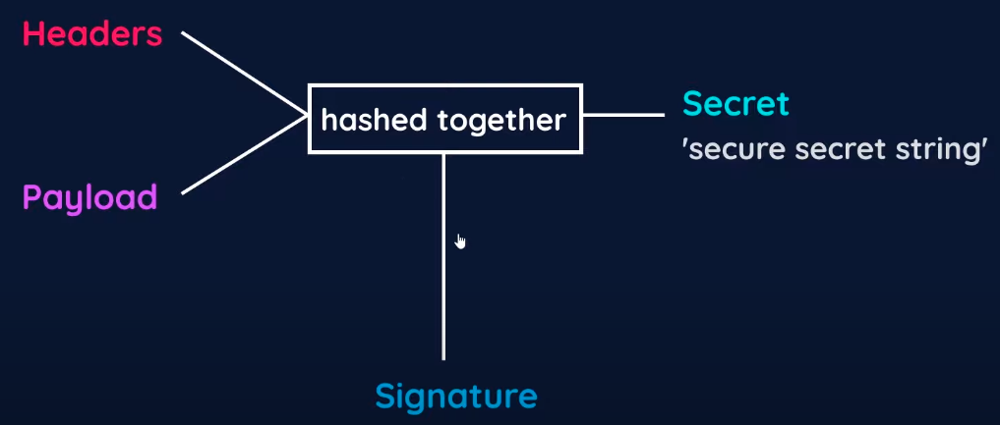

# Cookie
- A cookie is a piece of data generated by the server and sent back to the client to be stored on the client side
- Whenever the client makes a request, any existing cookies from that server will be attached along
- `Expires: Session` means that the cookie will be deleted once the user quits the browser
  
# JWT 
- The JSON Web Token has three parts:
  - Headers: Tells the server what type of signature is being used (meta)
  - Payload: Used to identify the user, for example, contains user id
  - Signature: Makes the token secure (stamp of signature)
- JWT Workflow:
  1. After the user successfully signs up or logs in, the Headers and Payload are created first and encoded
  2. To create the Signature, the Headers and Payload are hashed together, along with a Secret (a secure secret string) that is known and accessible only by the server.
    
  3. The Signature is then added as the third part in the complete JWT token (Headers.Payload.Signature), resulting in a token as in the image below
    
  4. The token is sent back to the browser as a cookie. In all subsequent requests from the browser, the cookie will also be sent along for access verification
  5. The server can verify by hashing the Headers and the Payload with the Secret and check if that hash of those three things matches the Signature (which is also the hash of those three from earlier) 